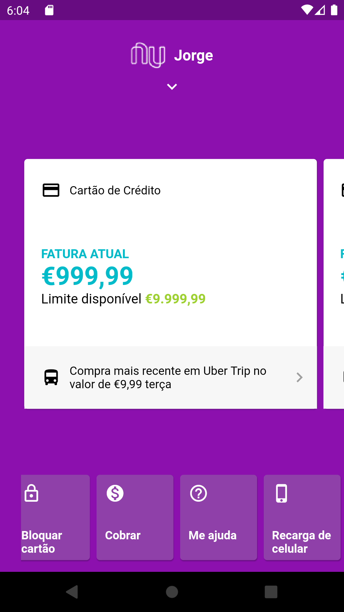

# Project Name
> Nubank UI clone

## Table of contents
* [General info](#general-info)
* [Screenshots](#screenshots)
* [Technologies](#technologies)
* [Status](#status)
* [Inspiration](#inspiration)
* [Contact](#contact)

## General info
Studying flutter and trying to clone the UI of a very famous digital bank in Brazil

## Screenshots

## Technologies
* Flutter
* Visual Studio Code

## Status
Project is: under development

## Contact
Created by [@jorgepezzuol](https://www.linkedin.com/in/jorge-pezzuol/) - feel free to contact me!
